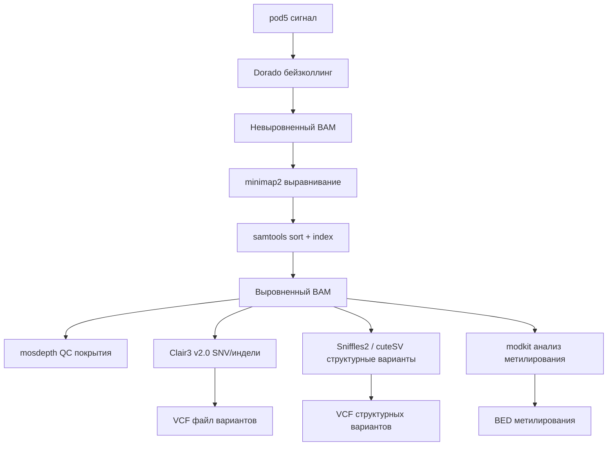

# Секвенирование генома в домашних условиях: гиперглубокий анализ

## Академическое исследование на основе мировых практик · Апрель 2026

---

> **Контекст**. Настоящая статья представляет собой гиперглубокий аналитический разбор публикации *«How I Sequenced My Genome at Home»* (iwantosequencemygenomeathome.com, апрель 2026) с привлечением актуальных мировых практик, технических спецификаций, академических публикаций и индустриального контекста на апрель 2026 года. Формат — структурированный исследовательский обзор уровня review article.

---

## Содержание

1. [Исполнительное резюме](#1-исполнительное-резюме)
2. [Историческая эволюция стоимости секвенирования](#2-историческая-эволюция-стоимости-секвенирования)
3. [Физика и инженерия нанопорового секвенирования](#3-физика-и-инженерия-нанопорового-секвенирования)
4. [Аппаратная платформа MinION Mk1D: спецификации и архитектура](#4-аппаратная-платформа-minion-mk1d-спецификации-и-архитектура)
5. [Полный протокол: от буккального мазка до .bam файла](#5-полный-протокол-от-буккального-мазка-до-bam-файла)
6. [Adaptive Sampling: программируемое обогащение in silico](#6-adaptive-sampling-программируемое-обогащение-in-silico)
7. [Бейзколлинг: нейросетевая конвертация сигнала в последовательность](#7-бейзколлинг-нейросетевая-конвертация-сигнала-в-последовательность)
8. [Биоинформатический конвейер: от прочтений до вариантов](#8-биоинформатический-конвейер-от-прочтений-до-вариантов)
9. [Клинические приложения: HLA, фармакогеномика, структурные варианты](#9-клинические-приложения-hla-фармакогеномика-структурные-варианты)
10. [ИИ-модели для интерпретации генома: AlphaGenome, Evo 2, AlphaMissense](#10-ии-модели-для-интерпретации-генома-alphagenome-evo-2-alphamissense)
11. [Сравнительный анализ технологий: ONT vs Illumina vs PacBio](#11-сравнительный-анализ-технологий-ont-vs-illumina-vs-pacbio)
12. [Экономика домашнего секвенирования](#12-экономика-домашнего-секвенирования)
13. [Регуляторный, этический и биозащитный ландшафт](#13-регуляторный-этический-и-биозащитный-ландшафт)
14. [Критический анализ оригинальной статьи](#14-критический-анализ-оригинальной-статьи)
15. [Стратегический прогноз и перспективы](#15-стратегический-прогноз-и-перспективы)
16. [Библиография](#16-библиография)

---

## 1. Исполнительное резюме

В апреле 2026 года секвенирование собственного генома на кухонном столе перешло из категории научной фантастики в категорию технически осуществимого проекта для мотивированного энтузиаста. Ключевой enabler — **Oxford Nanopore MinION** — портативный секвенатор массой 130 г, стоимостью ~$3 200, использующий белковые нанопоры для чтения одиночных молекул ДНК в реальном времени.

### Ключевые параметры одного прогона

| Параметр | Значение |
|---|---|
| Стоимость за прогон | ~$1 100 (проточная ячейка + реагенты) |
| Hands-on время | ~4 часа |
| Общее время до .bam | ~72 часа |
| Выход данных | 20–40 Гб |
| Покрытие (1 ячейка, WGS) | ~10× |
| Покрытие (1 ячейка, панель <1%) | 30–50× |
| Длина прочтений | ~4 кб (буккальный мазок), >10 кб (кровь) |
| Точность, HAC модель | ~99% на пробу |
| Точность, SUP модель | ~99.5% на пробу |

> [!IMPORTANT]
> Это **не** клинический диагностический тест. Результаты не валидированы и не могут служить основанием для медицинских решений. Все находки требуют подтверждения в аккредитованной клинической лаборатории.

---

## 2. Историческая эволюция стоимости секвенирования

Снижение стоимости секвенирования генома человека — одна из самых драматических технологических ценовых кривых в истории, значительно опережающая закон Мура.

```
Год      Стоимость                      Технология
─────────────────────────────────────────────────────────────
2003     $2 700 000 000                 Human Genome Project (13 лет)
2007     $10 000 000                    Sanger + ранний NGS
2008     $1 000 000                     Переломный момент: NGS (Illumina)
2014     $1 000                         HiSeq X Ten (Illumina)
2022     $200                           NovaSeq X (Illumina)
2025     $100                           Ultima UG100 / Element VITARI (анонс)
2026     $100 (реагенты)               Element VITARI (отгрузки H2 2026)
                                        Ultima UG200 Ultra (>60 000 геномов/год)
```

### Контекст: $100-геном стал реальностью

В феврале 2026 года компания **Element Biosciences** представила **VITARI** — первую высокопроизводительную настольную систему секвенирования, способную производить полный геном человека при 30× покрытии за $100 (стоимость реагентов). Параллельно **Ultima Genomics** анонсировала **UG200 Ultra** — двухпластинную систему, способную секвенировать >60 000 геномов в год.

> [!NOTE]
> Стоимость «$100 за геном» относится к реагентному бюджету в централизованной лаборатории с высокой пропускной способностью. Реальная стоимость с учётом труда, пробоподготовки, хранения данных и анализа — значительно выше. Домашнее нанопоровое секвенирование при ~$1 100 за прогон занимает иную нишу: автономность, приватность данных и тактильный контроль над процессом.

---

## 3. Физика и инженерия нанопорового секвенирования

### 3.1. Принцип чтения

Нанопоровое секвенирование основано на измерении ионного тока, проходящего через единичный белковый канал (нанопору) шириной ~1 нм, встроенный в синтетическую полимерную мембрану.

**Механизм (пошагово):**

1. **Напряжение**: Через мембрану прикладывается постоянное электрическое напряжение (~180 мВ), создающее ионный ток через поры.

2. **Протяжка**: Моторный белок (геликаза), прикреплённый к секвенирующему адаптеру, контролирует скорость протяжки одноцепочечной ДНК через пору — примерно **400 оснований в секунду**.

3. **Модуляция тока**: Каждое основание (A, C, G, T), проходящее через самое узкое место поры (constriction zone), изменяет электрическое сопротивление по-разному. В реальности считывается сигнал от **k-мера** — перекрывающегося окна из 5–6 оснований, находящихся одновременно в зоне чтения.

4. **Оцифровка**: Аналоговый сигнал (squiggle) дискретизируется АЦП с частотой ~4 кГц и сохраняется в формате **pod5** — проприетарном бинарном формате ONT.

5. **Нейросетевая декодировка**: Нейронная сеть (бейзколлер Dorado) преобразует waveform → A/C/G/T последовательность.

### 3.2. Архитектура проточной ячейки R10.4.1

| Параметр | Спецификация |
|---|---|
| Тип поры | CsgG мутант, R10.4.1 |
| Конфигурация | 2 048 пор в 512 каналах (4 поры/канал) |
| Гарантия активных пор | ≥800 (гарантийный порог ONT) |
| Типичное число активных пор | 1 200–1 800 |
| Максимальное время работы | 72 часа |
| Рекомендуемая температура хранения | +2–8 °C |
| Тип | Одноразовая |
| Стоимость | ~$900 |

### 3.3. Эволюция химии пор

Переход от R9.4.1 к R10.4.1 — это не просто итерация, а **фундаментальная смена архитектуры чтения**:

- **R9.4.1** (устаревшая): одиночная зона сужения (single constriction). Сигнал определяется ~5-мером. Систематические ошибки в гомополимерных участках (AAAA, TTTT).
- **R10.4.1** (текущая): **двойная зона сужения** (dual constriction). Каждое основание влияет на сигнал дважды — при прохождении через каждую зону. Это эквивалентно увеличению эффективной длины k-мера, радикально снижая ошибки гомополимеров и увеличивая точность пробы до 99.5% (SUP).

---

## 4. Аппаратная платформа MinION Mk1D: спецификации и архитектура

### 4.1. Физические характеристики

| Параметр | Спецификация |
|---|---|
| Размеры | 125 × 55 × 13 мм |
| Масса | 130 г |
| Интерфейс | USB-C (обязательно; USB-A адаптеры **не поддерживаются**) |
| Максимальная мощность | 7.5 Вт |
| Рабочая температура | +10…+35 °C (функциональный диапазон +5…+40 °C) |
| Совместимые ячейки | FLO-MIN114 (R10.4.1), FLO-MIN004RA (RNA004), FLO-FLG114 (Flongle R10) |
| Программное обеспечение | MinKNOW ≥ 24.11.10 |

### 4.2. Ключевое отличие Mk1D от Mk1B

MinION Mk1D перенёс часть вычислительной нагрузки бейзколлинга **на устройство** (on-device compute), а также получил улучшенное пассивное теплоотведение. В остальном — та же химия, те же проточные ячейки, те же протоколы пробоподготовки.

### 4.3. Вычислительные требования

| Задача | Рекомендация автора | Альтернатива |
|---|---|---|
| Секвенирование + live HAC | Mac Studio M3 Ultra (Metal) | Любой Apple Silicon M3+ с ≥32 ГБ RAM |
| Пост-бейзколлинг SUP | DGX Spark GB10 (CUDA) | NVIDIA RTX 4090 / 5090 |
| Хранение данных (1 прогон) | ~100 ГБ | 300 ГБ для 3 прогонов (30× WGS) |

**Benchmark автора** (30 Гб прогон):

| Модель | Mac Studio M3 Ultra (Metal) | DGX Spark GB10 (CUDA) |
|---|---|---|
| HAC | 6.0 Msamples/s · ~17 ч (ночь) | 31.4 Msamples/s · ~3 ч (вечер) |
| SUP | 0.8 Msamples/s · 5+ дней | 3.4 Msamples/s · ~31 ч (след. вечер) |

> [!TIP]
> Разница в ~5× на HAC и ~4× на SUP между Metal и CUDA демонстрирует, что GPU-ускорение остаётся критическим для SUP-бейзколлинга. Однако **GPU не является обязательным**: HAC на Apple Silicon покрывает бо́льшую часть потребностей.

---

## 5. Полный протокол: от буккального мазка до .bam файла

### 5.0. Канонические протоколы-источники

Два фабричных протокола покрывают всю мокрую часть:
1. **NEB Monarch T3010** — экстракция ДНК из буккальных мазков
2. **ONT SQK-LSK114** — лигационная пробоподготовка и загрузка ячейки

### 5.1. Этап 1: Предварительная подготовка (~30 минут)

| Шаг | Действие | Критичная деталь |
|---|---|---|
| 1 | Установка MinKNOW | Скачивается из ONT Community Portal (бесплатная регистрация) |
| 2 | Проверка проточной ячейки | Дать прогреться 20 мин → запустить pore check: ≥800 пор → ОК |
| 3 | Подготовка поверхности | Протереть 70% изопропанолом, промаркировать все пробирки |
| 4 | Разморозка реагентов | Из –20 °C на лёд (пенопластовый контейнер) |
| 5 | (Adaptive sampling) Подготовить BED-файл | GRCh38 координаты, padding ±100 кб, суммарный таргет <5% генома |

> [!WARNING]
> Если проточная ячейка показывает <800 активных пор — **не загружать ДНК**. Заявить гарантийный случай в ONT до того, как ячейка будет использована.

### 5.2. Этап 2: Экстракция ДНК (~45 минут)

**Источник**: Клетки буккального эпителия (слизистая щеки).

**Протокол (NEB Monarch T3010):**

```
1. Буккальный мазок стерильным флокированным тампоном
   → 60 секунд на каждую щёку
   
2. Тампон в 1 мл холодного PBS в 1.5 мл пробирке
   → вортекс 10 сек → извлечь тампон
   
3. Центрифугирование: 2 000 g × 30 сек → пеллет клеток
   → отобрать PBS сверху, оставив ~100 мкл
   → ресуспендировать щелчком по пробирке
   
4. Лизис: Proteinase K + RNase A + Cell Lysis Buffer
   → инкубация 56 °C на термоблоке
   
5. Привязка к силикагелевой колонке → промывка → элюция
```

**Ключевые лайфхаки автора:**

- **Преднагреть элюционный буфер до 60 °C** перед финальной элюцией. Без этого — до 50% ДНК остаётся на колонке.
- Элюат должен быть **прозрачным и бесцветным**. Мутность = солевой перенос → повторная промывка.
- Один тампон даёт **5–7 мкг ДНК**, это значительно больше минимума 1 мкг для пробоподготовки.
- Кровь даёт лучшее качество (более длинные фрагменты, выше DIN), но требует навыков забора.

**Контроль качества (QC):**

| QC-этап | Стандартный инструмент | Решение автора |
|---|---|---|
| Концентрация ДНК | Qubit флуорометр (~$500) | DIYnafluor (в разработке, ~$80) |
| Распределение длин фрагментов | Гель-электрофорез / TapeStation | В процессе тестирования |

> [!CAUTION]
> Автор отмечает, что пропуск QC концентрации на первом прогоне привёл к низкой загрузке пор — без способа определить, был ли виноват выход экстракции или пробоподготовка. **Рекомендация: не пропускать QC, даже если нет Qubit**.

### 5.3. Этап 3: Пробоподготовка библиотеки (~70 минут)

Превращение сырой ДНК в «библиотеку» — набор фрагментов, модифицированных для прохождения через нанопору.

**Три биохимических шага:**

```
Шаг 1: FFPE-репарация + концевая подготовка (End repair)
  → Репарационные ферменты полируют повреждённые концы фрагментов
  → Добавляется одиночный аденин (A-tailing) к 3'-концу
  → ~25 мин инкубация

Шаг 2: Очистка на AMPure бидах (~15 мин)
  → Магнитные бусины связывают ДНК
  → Супернатант удаляется на магнитном штативе

Шаг 3: Лигирование секвенирующего адаптера (~15 мин)
  → Адаптер с T-овисающим концом лигируется к A-хвосту
  → Адаптер несёт МОТОРНЫЙ БЕЛОК — критический компонент

Шаг 4: Финальная очистка с LFB (~15 мин)
  → Long Fragment Buffer (НЕ этанол!)
```

**Пять критических ловушек, описанных автором:**

| # | Ошибка | Последствие | Правильно |
|---|---|---|---|
| 1 | Вортексирование ферментных смесей | Пенообразование → денатурация | Перемешивать щелчком |
| 2 | Вортексирование Ligation Buffer (LNB) | Вязкий → невидимое расслоение | Пипетирование медленно |
| 3 | Пересушивание AMPure пеллета | Бусины трескаются и «привариваются» к пробирке | 30 секунд воздушной сушки, не более |
| 4 | Использование этанола для второй очистки | Этанол разрушает моторный белок адаптера | Использовать **LFB** |
| 5 | Нетерпеливость на магнитном штативе | Потеря ДНК с суспензией бусин | Подождать 2–2.5 мин до полного осветления |

**Выход**: 150–450 нг библиотеки в 15 мкл. 12 мкл → на ячейку, 3 мкл → резерв для перезагрузки.

### 5.4. Этап 4: Загрузка проточной ячейки (~15 минут)

> [!CAUTION]
> **Самый высокорисковый этап всего протокола.** Единственная ошибка — пузырёк воздуха, прошедший через массив пор — может вывести из строя тысячу пор ($900 расходника). **Обязательно просмотрите обучающее видео ONT перед загрузкой.**

**Ключевой лайфхак автора:**

> «Вместо того чтобы нажимать плунжер пипетки P1000 большим пальцем для отбора буферного раствора, **вращайте колёсико объёма вверх** — создаваемое разрежение значительно мягче и контролируемее, и вероятность перетянуть жидкость и повредить поры гораздо ниже.»

**Правила безопасности:**
- Никогда не отбирать >30 мкл через порт заправки
- Дозировать праймерную смесь и библиотеку **медленно** — без захвата воздуха
- При появлении пузырька: **СТОП** → аккуратно отобрать → продолжить

**Опыт автора:**
На первом прогоне MinKNOW показал **ноль активных пор** после загрузки. При осмотре обнаружен пузырёк у порта. Пузырёк не дошёл до массива → удалось отобрать без потери пор. Если бы он достиг массива — ячейка была бы «убита».

### 5.5. Этап 5: Секвенирование (48 часов)

**Конфигурация в MinKNOW:**

```yaml
kit:             "SQK-LSK114"
flow_cell:       "FLO-MIN114"
basecalling:     "Dorado HAC @ v5.2.0, real-time"
adaptive_sampling:
  enabled:       true     # только для таргетного секвенирования
  mode:          "enrich"
  bed_file:      "./panels/pharmacogenes.bed"
  reference:     "./ref/GRCh38.fa"
```

**Мониторинг во время прогона:**

| Метрика | Здоровое значение | Действие при отклонении |
|---|---|---|
| Pore occupancy | >50% (начало) → >30% (24 ч) | При <30% @ 24 ч → нуклеазная промывка (EXP-WSH004) + перезагрузка |
| Translocation speed | ~400 б/с, стабильно | Резкое падение = повреждённые поры |
| Read length distribution | Пик ~4 кб (буккальный мазок) | Широкий правый хвост = хороший лизис |

**Ожидаемый выход:** 20–40 Гб за 48 часов.

### 5.6. Этап 6: Бейзколлинг

> Подробно — см. [раздел 7](#7-бейзколлинг-нейросетевая-конвертация-сигнала-в-последовательность)

### 5.7. Этап 7: Выравнивание и QC покрытия

> Подробно — см. [раздел 8](#8-биоинформатический-конвейер-от-прочтений-до-вариантов)

---

## 6. Adaptive Sampling: программируемое обогащение in silico

### 6.1. Концепция

Adaptive sampling — это уникальная для нанопорового секвенирования возможность **программного обогащения участков генома в реальном времени**, без дополнительных зондов, без ПЦР, без специальной пробоподготовки.

### 6.2. Механизм

```
Для каждого фрагмента ДНК, входящего в пору:

1. Первые ~500 оснований читаются нормально
   ↓
2. MinKNOW сравнивает 500 б с референсным геномом (GRCh38)
   ↓
3. Фрагмент из интересующего региона?
   ├── ДА → продолжить чтение полного фрагмента
   └── НЕТ → инвертировать напряжение на поре
              → физически выбросить нить ДНК
              → подождать, пока новый фрагмент войдёт в пору
```

### 6.3. Количественные параметры обогащения

| Размер таргета | Ожидаемое покрытие (1 ячейка) | Эффективность обогащения |
|---|---|---|
| 5% генома (~160 Мб) | 10–15× | 2–3× |
| 1% генома (~32 Мб) | 30–50× | 5–10× |
| 0.1% генома (~3.2 Мб) | 100–200× | 30–50× |

### 6.4. Стратегический выбор: Option A vs Option B

**Option A: Полный геном, неглубокий (~10×)**
- Покрывает все 3.2 Гб
- Достаточно для вызова **распространённых вариантов** (MAF ≥5%)
- Недостаточно для **редких патогенных вариантов** (MAF ≤0.1%)
- Три ячейки → ~30× для клинического уровня

**Option B: Таргетная панель, глубокая (30–50×)**
- Панель <1% генома (HLA, фармакогены, аутоиммунные локусы)
- Достаточно для клинически значимого вариант-колинга
- Одна ячейка = один прогон
- Наиболее рациональный выбор для домашнего использования

### 6.5. Создание BED-файла панели

Автор рекомендует использовать LLM (Claude, GPT) для:
1. Идентификации генов, релевантных клиническому вопросу
2. Генерации BED-файла в координатах GRCh38 с padding ±100 кб
3. Проверки суммарного размера таргета (<5% генома)

**Формат BED-файла:**
```
chr6    28477797    33448354    HLA_region
chr10   94762681    94855547    CYP2C19
chr22   42126499    42130881    CYP2D6
chr17   43044295    43170245    BRCA1
chr13   32315474    32400266    BRCA2
```

> [!TIP]
> Padding ±100 кб захватывает регуляторные элементы. Большая часть клинически значимых вариаций находится **не** в кодирующих последовательностях, а в регуляторных регионах — энхансерах, промоторах, сайтах сплайсинга.

---

## 7. Бейзколлинг: нейросетевая конвертация сигнала в последовательность

### 7.1. Архитектура Dorado

**Dorado** — штатный бейзколлер ONT, заменивший Guppy. По состоянию на март 2026 года произошёл архитектурный переход:

| Аспект | До марта 2026 | С марта 2026 |
|---|---|---|
| Архитектура HAC | LSTM (рекуррентная) | LSTM (оптимизированная) |
| Архитектура SUP | LSTM | **Transformer-based** |
| Преимущество | Высокая оптимизация | Параллельная обработка, лучшее моделирование зависимостей |

### 7.2. Модели и их характеристики

| Модель | Точность на пробу | Скорость (Mac M3 Ultra) | Назначение |
|---|---|---|---|
| FAST | ~97% | Максимальная | Скрининг, предварительный просмотр |
| HAC (высокая точность) | ~99% | 6.0 Msamples/s | Живой бейзколлинг, рабочий стандарт |
| SUP (суперточность) | ~99.5% | 0.8 Msamples/s | Клинически важные регионы |

### 7.3. Статистика ошибок и голосование по покрытию

Одиночное прочтение имеет **1–2% вероятность ошибки** на любое основание. Механизм коррекции — **голосование по покрытию**:

```
Покрытие   P(все n прочтений ошибаются одинаково)   Качество
─────────────────────────────────────────────────────────────
1×         1–2 × 10⁻²                                Низкое
5×         ~10⁻¹⁰                                    Умеренное
10×        ~10⁻²⁰                                    Хорошее (распространённые варианты)
30×        ~10⁻⁶⁰                                    Клинический стандарт
```

### 7.4. Метилирование «бесплатно»

> [!NOTE]
> ONT добавила детекцию метилирования (5mC, CpG) через **программное обновление нейросети** — без новой химии, без новых ячеек. Сеть различает метилированный и неметилированный цитозин по тому же электрическому сигналу. Прочтения получают per-base теги метилирования внутри BAM-файла. Это одно из наиболее впечатляющих примеров программного расширения возможностей аппаратной платформы.

### 7.5. HERRO: гаплотип-ориентированная коррекция ошибок

Алгоритм **HERRO**, интегрированный в экосистему Dorado, обеспечивает коррекцию ошибок отдельных прочтений с учётом гаплотипов:
- Повышает качество *de novo* сборок диплоидных организмов
- Особенно ценен при сборке без референса
- Позволяет достигать высококачественных сборок «только на нанопоре» без Illumina-полишинга

---

## 8. Биоинформатический конвейер: от прочтений до вариантов

### 8.1. Референсная архитектура конвейера (апрель 2026)



### 8.2. Командная строка

```bash
# 1. Бейзколлинг (HAC, автовыбор GPU/Metal/CPU)
dorado basecaller \
  -x auto \
  ~/models/dna_r10.4.1_e8.2_400bps_hac@v5.2.0 \
  ~/runs/2026-04-18/pod5/ > reads.hac.bam

# 2. Выравнивание, сортировка, индексирование
minimap2 -ax map-ont --MD ref/GRCh38.fa reads.hac.bam \
  | samtools sort -o aligned.bam -
samtools index aligned.bam

# 3. Контроль качества
samtools flagstat aligned.bam             # ожидаем >95% mapped
mosdepth --by panels/pharmacogenes.bed cov aligned.bam  # покрытие по регионам

# 4. Вариант-колинг (Clair3 v2.0 + PyTorch, GPU)
run_clair3.sh \
  --bam_fn=aligned.bam \
  --ref_fn=ref/GRCh38.fa \
  --output=variants/ \
  --threads=32 \
  --platform="ont" \
  --model_path="${CLAIR3_MODELS}/ont_r10.4.1_hac"

# 5. Структурные варианты
sniffles --input aligned.bam --vcf structural_variants.vcf \
  --reference ref/GRCh38.fa

# 6. Метилирование
modkit pileup aligned.bam methylation.bed --ref ref/GRCh38.fa
```

### 8.3. Clair3 v2.0: ключевые обновления (февраль 2026)

| Аспект | Clair3 v1.x | Clair3 v2.0 |
|---|---|---|
| Фреймворк | TensorFlow | **PyTorch** |
| Скорость (WGS, 32 потока + GPU) | ~2 часа | **12–20 минут** |
| Совместимость моделей | TF модели | PyTorch модели (обновлённые из rerio) |
| Семейное трио | Clair3-Trio v1 | **Clair3-Trio v2** (менделевская информация) |

### 8.4. Верификация Adaptive Sampling

Для проверки эффективности обогащения:

```bash
# Ожидание при 1% панели: 5–6× обогащение
# Если 1× — adaptive sampling не был активен
# Если 10×+ — BED-файл меньше ожидаемого, или низкий выход
```

### 8.5. Что из себя представляет aligned.bam

Финальный файл `aligned.bam` содержит:
- ~30 Гб прочтений, картированных на позиции референсного генома
- Качество оснований (Phred scores)
- Per-base метилирование (если включено)
- Информацию для фазирования гаплотипов (родительских хромосом)

---

## 9. Клинические приложения: HLA, фармакогеномика, структурные варианты

### 9.1. HLA-типирование

Локус HLA (Human Leukocyte Antigen) на хромосоме 6 — один из наиболее полиморфных регионов генома человека, критический для:
- Трансплантационной совместимости
- Предрасположенности к аутоиммунным заболеваниям
- Фармакогенетических реакций (например, HLA-B*57:01 и абакавир)

**Преимущества нанопорового секвенирования для HLA:**

| Аспект | Короткие прочтения (Illumina) | Длинные прочтения (ONT) |
|---|---|---|
| Разрешение аллелей | 2–4 поля (серологический уровень) | **4 поля (высокое разрешение)** |
| Фазирование | Требует семейных образцов | **Прямое из одиночного образца** |
| Новые аллели | Пропускаются | Обнаруживаются |
| Время оборота | Дни (централизованная лаборатория) | **4 дня (март 2026, clinical research)** |

> [!IMPORTANT]
> Исследование марта 2026 года продемонстрировало использование нанопорового adaptive sampling для одновременного профилирования HLA и групп крови без амплификации, с турнарандом 4 дня и точностью, сопоставимой с золотыми стандартами.

### 9.2. Фармакогеномика

**Ключевые гены фармакокинетики:**

| Ген | Функция | Клиническое значение |
|---|---|---|
| CYP2D6 | Метаболизм ~25% лекарств | Статус метаболизатора (poor/intermediate/extensive/ultra-rapid) |
| CYP2C19 | Метаболизм клопидогреля, ИПП | Антитромбоцитарная терапия |
| CYP2C9 | Метаболизм варфарина, НПВС | Дозировка антикоагулянтов |
| DPYD | Метаболизм фторпиримидинов | Токсичность 5-ФУ (летально) |
| TPMT/NUDT15 | Метаболизм тиопуринов | Иммуносупрессия (AZT, 6-МП) |
| UGT1A1 | Глюкуронизация | Синдром Жильбера, токсичность иринотекана |

**Преимущество ONT для CYP2D6:**

CYP2D6 — один из наиболее сложных для типирования генов: множество структурных вариантов (делеции, дупликации, гибридные аллели CYP2D6/CYP2D7). Длинные прочтения позволяют однозначно разрешить star-аллели, которые «неприступны» для коротких прочтений.

### 9.3. Структурные варианты

Длинные прочтения ONT открывают класс вариаций, практически невидимый для коротких прочтений:

| Тип SV | Размер | Видимость (Illumina) | Видимость (ONT) |
|---|---|---|---|
| Крупные делеции | >1 кб | Косвенная | **Прямая** |
| Инсерции | >300 б | Пропускаются | **Обнаруживаются** |
| Инверсии | >1 кб | Редко | **Прямое перекрытие** |
| Транслокации | — | Сложно | **Прямое перекрытие** |
| Экспансии повторов | Любой | «Тёмные» зоны генома | **Прямое чтение** |

**Инструменты SV-колинга для ONT (2026):**
- **Sniffles2**: стандарт для SV из длинных прочтений
- **cuteSV**: альтернатива с оптимизацией для ONT
- **SVIM**: специализированный инструмент для инсерций

### 9.4. Конкретный клинический контекст автора

Автор описывает семейную историю тяжёлых аутоиммунных заболеваний. Его сестра в возрасте <40 лет перенесла трансплантацию печени из-за первичного билиарного холангита (ПБХ) — аутоиммунного заболевания, при котором иммунная система атакует мелкие жёлчные протоки, приводя к фиброзу и циррозу органа.

**Релевантные геномные регионы для аутоиммунности:**
- HLA-DRB1, HLA-DQB1 (основные локусы предрасположенности к ПБХ)
- IL12A, IL12RB2 (сигнальный путь IL-12, ассоциированный с ПБХ)
- IRF5, STAT4 (транскрипционные факторы, ассоциированные с волчанкой, РА, ПБХ)
- CTLA4 (регулятор T-клеточного ответа)
- TNFAIP3 (A20, негативный регулятор NF-κB)

---

## 10. ИИ-модели для интерпретации генома: AlphaGenome, Evo 2, AlphaMissense

### 10.1. AlphaGenome (Google DeepMind)

Анонсирован в июне 2025, опубликован в *Nature* в январе 2026. Ключевое: **единая модель для предсказания функционального воздействия вариантов в некодирующей части генома** (98% всех вариантов).

| Параметр | Спецификация |
|---|---|
| Входная последовательность | До 1 Мб (1 млн п.н.) |
| Разрешение предсказания | Однонуклеотидное |
| Модальности вывода | 11: экспрессия генов, сплайсинг, доступность хроматина, гистоновые модификации, связывание TF, 3D-контактные карты и др. |
| Архитектура | U-Net backbone + свёрточные слои + трансформерные блоки |
| Бенчмарк | Превосходит специализированные модели в 25 из 26 задач |
| Доступ | API (non-commercial preview) |

**Применение к домашнему секвенированию:**

Автор планирует пропустить свои нанопоровые прочтения через AlphaGenome для предсказания функциональных эффектов некодирующих вариантов — тех, которые традиционно считались «мусорной» ДНК и не анализировались клинически.

### 10.2. Evo 2 (Arc Institute)

Опубликован в *Nature* в марте 2026. Фундаментальная модель геномики, обученная на 9.3 трлн нуклеотидов из >128 000 полных геномов.

| Параметр | Спецификация |
|---|---|
| Архитектура | StripedHyena 2 (субквадратичное масштабирование) |
| Число параметров | 40 млрд |
| Контекстное окно | До 1 Мб |
| Возможности | Предсказание + генеративный дизайн (ДНК, РНК, белки) |
| Обучающая выборка | OpenGenome2 (128 000+ геномов, все домены жизни) |

**Ключевые возможности:**
- Предсказание патогенных мутаций в генах человека
- Генерация функциональных бактериофагов (экспериментально подтверждено)
- Предсказание 3D-организации генома (Hi-C контактные матрицы)
- In-context learning (ICL), аналогичное LLM

### 10.3. AlphaMissense (Google DeepMind)

В отличие от AlphaGenome, **AlphaMissense** работает с **кодирующей** частью генома (2%):
- Предсказывает патогенность миссенс-мутаций (однобукзвенные замены аминокислот)
- Классифицировал 89% из 71 млн возможных миссенс-мутаций
- Дополняет AlphaGenome: вместе они покрывают кодирующий + некодирующий геном

### 10.4. Парадигма Патрика Коллисона

Сооснователь Stripe и Arc Institute Патрик Коллисон в апреле 2026 описал свой подход:

1. Полногеномное секвенирование (~$200)
2. Анализ AI-кодинг-агентами (< $100)
3. Результат: обнаружена 30-кратная предрасположенность к меланоме
4. Рекомендации: специфические тесты, добавки, увеличенная частота скринингов

> «Популяционные средние — это популяционные средние, но мы сами — не средние.»  
> — Патрик Коллисон

---

## 11. Сравнительный анализ технологий: ONT vs Illumina vs PacBio

### 11.1. Обзорная таблица (апрель 2026)

| Характеристика | ONT (MinION) | Illumina (NovaSeq X) | PacBio (Revio) |
|---|---|---|---|
| **Тип прочтений** | Длинные (4–100+ кб) | Короткие (150–300 б) | Длинные (10–25 кб, HiFi) |
| **Точность прочтения** | 99–99.5% (HAC/SUP) | 99.9%+ | 99.9%+ (HiFi) |
| **Стоимость генома (30×)** | ~$3 300 (3 ячейки) | ~$200 | ~$1 000 |
| **Портативность** | 130 г, кухонный стол | Серверный шкаф | Настольное, крупное |
| **Время до данных** | Реальное время | 24–48 ч (batch) | 24 ч |
| **Метилирование** | Нативное (5mC, 6mA) | Бисульфитная конверсия | Нативное (HiFi) |
| **Adaptive sampling** | ✅ Уникальное | ❌ | ❌ |
| **Структурные варианты** | Превосходно | Ограниченно | Превосходно |
| **Гомополимеры** | Улучшено в R10.4.1 | Отлично | Отлично |
| **Домашнее использование** | ✅ Возможно | ❌ Невозможно | ❌ Невозможно |
| **Статус для диагностики** | RUO | CE-IVD / FDA | RUO / LDT |

### 11.2. Позиционирование домашнего секвенирования

MinION занимает уникальную нишу: **единственная технология, которая физически может быть развёрнута вне лабораторного учреждения**. Это не конкуренция с Illumina за стоимость — это создание принципиально нового контекста использования.

### 11.3. Гибридный подход (Gold Standard 2026)

Золотой стандарт для максимальной полноты генома в клинических исследованиях:
- **ONT**: длинные прочтения → SV, повторы, фазирование, метилирование
- **Illumina**: короткие прочтения → высокоточные SNV, индели
- **Гибридная сборка**: объединение → максимальная полнота и точность

---

## 12. Экономика домашнего секвенирования

### 12.1. Детализированная стоимость одного прогона

| Компонент | Цена пакета | Число реакций | Цена за 1 прогон |
|---|---|---|---|
| Проточная ячейка FLO-MIN114 | $900 | 1 | **$900** |
| Лигационный кит SQK-LSK114 | $610 | 6 | ~$100 |
| NEBNext Companion E7672S | $1 275 | 24 | ~$55 |
| Monarch T3010 DNA extraction | $150 | 50 | ~$3 |
| Flow Cell Wash EXP-WSH004 | — | — | ~$17 |
| Расходники (наконечники, пробирки, этанол, PBS) | ~$50 | — | ~$50 |
| **ИТОГО за прогон** | | | **~$1 100** |

### 12.2. Разовые инвестиции

| Оборудование | Стоимость | Примечание |
|---|---|---|
| MinION Mk1D | ~$3 200 | Многоразовый |
| Термоблок (56 °C / 65 °C) | $50–300 | eBay / AliExpress |
| Микроцентрифуга (12 000 g) | $100–400 | Лабораторный б/у |
| Вортекс | $30–100 | Vortex-Genie 2 в производстве с 1960-х |
| Пипетки (P10, P20, P200, P1000) | $200–800 | **Критично: откалиброванные** (Gilson/Rainin/Eppendorf) |
| Магнитный штатив | $7–50 | 3D-печать + неодимовые магниты N52 |
| Компьютер (Apple Silicon M3+) | $2 000–6 000 | Если нет — основная инвестиция |
| **ИТОГО (оборудование)** | **$3 600–$10 800** | Одноразовые инвестиции |

### 12.3. Проблема балк-упаковки

> Центральная экономическая проблема автор формулирует точно: реагенты упакованы для лабораторий, обрабатывающих десятки образцов в неделю. SQK-LSK114 — пакет на 6 реакций, NEB Companion — на 24. При одном прогоне 23 из 24 реакций пропадают (с учётом срока годности).

**Решение автора**: закупка оптом → фасовка в single-run наборы для сообщества. Параллельно — программа аренды MinION для тех, кто хочет попробовать без $3 200 вложений.

### 12.4. Сравнение затрат

| Подход | Стоимость данных | Покрытие | Контроль данных |
|---|---|---|---|
| 23andMe (генотипирование) | ~$200 | ~650 000 SNP | Корпоративная БД |
| Nebula Genomics (WGS) | ~$250 | 30× | «Privacy-first», но облако |
| Домашний MinION (1 ячейка) | ~$1 100 | 10× WGS / 30–50× панель | **Полный локальный** |
| Домашний MinION (3 ячейки) | ~$3 300 | 30× WGS | **Полный локальный** |

---

## 13. Регуляторный, этический и биозащитный ландшафт

### 13.1. Регуляторный статус

| Юрисдикция | Статус | Детали |
|---|---|---|
| США (федеральный) | Нет регулирования | MinION = RUO (Research Use Only). Нет FDA-одобрения для DTC-геномики с ONT |
| США (штаты) | Мозаика законов | South Dakota SB 49 (июль 2026), Connecticut (октябрь 2026): права на удаление генетических данных |
| ЕС | IVDR 2017/746 | ONT не имеет CE-IVD маркировки для домашнего использования |
| Великобритания | Нет ограничений для самосеквенирования | Нет запрета; результаты нельзя использовать для диагностики |
| Россия | Не регулируется отдельно | Отсутствует законодательство о DTC-геномике; секвенирование собственного генома не запрещено |

### 13.2. Приватность генетических данных

**Генетические данные — уникально чувствительный актив:**

- Невозможно «сбросить» в случае утечки (в отличие от пароля)
- Идентифицируют не только субъект, но и его родственников
- GINA (Genetic Information Nondiscrimination Act, США) **не защищает** от дискриминации в страховании жизни, инвалидности и долгосрочного ухода
- Банкротство 23andMe (2024) вызвало волну опасений о судьбе 15 млн генетических профилей

**Домашнее секвенирование как ответ:**

Одна из ключевых мотиваций движения citizen genomics — **суверенитет данных**. При домашнем секвенировании:
- Данные никогда не покидают локальную машину
- Нет облачных хранилищ третьих лиц
- Нет ToS, позволяющих перепродажу данных

### 13.3. Биобезопасность

> [!WARNING]
> По мере демократизации технологий секвенирования возникают вопросы биобезопасности:
> - Уязвимости конвейера секвенирования (от пробоподготовки до облачного анализа)
> - Потенциальное использование секвенирования для конструирования патогенов
> - **Biosecurity Modernization and Innovation Act of 2026** (федеральный, США) — требования к провайдерам генного синтеза по скринингу заказчиков

### 13.4. Этические аспекты

| Проблема | Описание |
|---|---|
| Incidental findings | Обнаружение непредвиденных патогенных вариантов: BRCA1/2, Li-Fraumeni, Хантингтон. Психологическое бремя без клинического руководства |
| Информированное согласие | Субъект (он же оператор) — может не осознавать масштаб раскрываемой информации |
| Родственники | Геном одного человека частично раскрывает геном кровных родственников, которые не давали согласия |
| Генетическая грамотность | Риск неверной интерпретации результатов → самолечение → вред |

---

## 14. Критический анализ оригинальной статьи

### 14.1. Сильные стороны

| Аспект | Оценка | Комментарий |
|---|---|---|
| Техническая точность | ★★★★★ | Описание физики нанопор, адаптивного сэмплинга, биоинформатики — корректно и точно |
| Практическая ценность | ★★★★★ | Реальные лайфхаки (пипетирование, бусины, пузырьки) — бесценны для first-timer |
| Структура | ★★★★★ | Логический поток от мотивации к протоколу и верификации |
| Честность | ★★★★★ | Открыто описаны ошибки первого прогона, ограничения QC |
| Доступность | ★★★★☆ | Баланс между техническим и разговорным стилями |
| Мотивация | ★★★★★ | Личная история с сестрой — мощный и аутентичный мотиватор |

### 14.2. Критические замечания

| # | Область | Замечание | Серьёзность |
|---|---|---|---|
| 1 | QC экстракции | Автор секвенировал без Qubit → неизвестная загрузка → низкая производительность первого прогона. Рекомендация скорректирована, но DIYnafluor ещё не собран | 🟡 Средняя |
| 2 | QC длин фрагментов | Нет гель-электрофореза → неизвестное распределение длин → невозможно оптимизировать библиотеку | 🟡 Средняя |
| 3 | Контаминация | Кухонный стол — не ламинарный бокс. Нет обсуждения рисков контаминации человеческой ДНК бактериальной ДНК окружающей среды | 🟡 Средняя |
| 4 | Вариант-колинг | Статья заканчивается на `aligned.bam` → анализ вариантов обещан «в следующем посте». Вызов вариантов при 10× WGS требует осторожности | 🟢 Низкая (планируется) |
| 5 | Клинические ограничения | Mega-disclaimer корректен, но мог быть размещён более заметно (в начале, а не в конце) | 🟡 Средняя |
| 6 | Воспроизводимость | Один прогон = n=1. Нет данных о воспроизводимости протокола другими операторами | 🟡 Средняя |
| 7 | Утилизация | Нет обсуждения утилизации биологических отходов (использованные пробирки с ДНК, проточные ячейки) | 🟢 Низкая |

### 14.3. Оценка как научной публикации

| Критерий | Соответствие | Примечание |
|---|---|---|
| Peer review | ❌ | Блог-пост, не рецензированная публикация |
| Воспроизводимость | Частичная | Протокол описан, но нет числовых результатов QC |
| Статистическая мощность | ❌ | n=1 |
| Конфликт интересов | Возможен | Автор планирует коммерциализацию (аренда MinION, наборы) |
| Этическая экспертиза | ❌ | Нет IRB/этического комитета |

> [!NOTE]
> Статья **не** позиционируется как научная публикация — это практическое руководство и документирование личного проекта. Критика выше касается академической строгости, а не качества контента в его собственном жанре.

---

## 15. Стратегический прогноз и перспективы

### 15.1. Технологический горизонт (2026–2030)

```
2026  MinION Mk1D + R10.4.1 + Dorado Transformer SUP
      ├── Качество: 99.5% single-read
      ├── Domestic WGS: технически возможно, экономически осмысленно для панелей
      └── AI интерпретация: AlphaGenome, Evo 2, AlphaMissense

2027  Прогнозируемые улучшения:
      ├── R11 / R12 химия пор → <0.1% ошибок single-read?
      ├── $500 проточные ячейки → $550 за прогон
      ├── Интегрированный бейзколлинг на устройстве
      └── On-device Clair3 → варианты в реальном времени

2028–2030  Перспективы:
      ├── «$50 геном» на нанопоре? (при серийном производстве ячеек)
      ├── Полностью автоматизированная пробоподготовка (lab-on-a-chip)
      ├── Регуляторная рамка для DTC-нанопорового секвенирования
      └── AI-агенты как «персональные генетические консультанты»
```

### 15.2. Футуристический горизонт (2031–2036): Solid-State Поры и Read-Write Экосистема

Если выйти за рамки текущего десятилетия, проект *HomeGenome* претерпит полную архитектурную трансформацию:

1. **Биологические поры → Твердотельные (Solid-State):**
   - Биомолекулярные ячейки (как FLO-MIN114) имеют срок годности и умирают от воздуха. Переход на графеновые твердотельные нанопоры сделает секвенатор 100% многоразовым, похожим на флешку без расходников (за исключением буфера).
   - Интеграция секвенаторов в смартфоны и носимые устройства для непрерывного мониторинга циркулирующей ДНК (cfDNA) и РНК.
2. **AI-Native Пайплайны:**
   - Исчезнут понятия `BAM`, `VCF` и «выравнивание». Фундаментальные модели (условный Evo 5) будут принимать гигантский тензор сырого тока directamente (RAW → Tensor) и сразу выдавать сеть метаболических рисков, фенотипические предсказания и 3D-фолдинг генома.
3. **От Read-Only к Read-Write (Интеграция с OpenRNA):**
   - Домашнее секвенирование станет только первым этапом комплекса. Вы обнаруживаете мутацию → локальная LLM разрабатывает компенсирующую РНК-вакцину → домашний настольный ДНК-принтер (развитие проекта OpenRNA) печатает персонализированную терапии на месте.
4. **Реал-тайм мультиомика:** 
   - Нанопоры научатся читать белки с той же легкостью, что и ДНК/РНК, что позволит дома анализировать свой полный протеом и транскриптом по одной капле крови за минуты.

### 15.3. Формирующееся движение Citizen Genomics (2026+)

В 2026 году наблюдается конвергенция четырёх трендов:

1. **Аппаратная демократизация**: MinION = первый секвенатор, доступный индивидуальному пользователю без институциональной аффилиации

2. **AI как ментор лаборатории**: LLM (Claude, GPT) снижают порог входа в молекулярную биологию, помогают с протоколами, дизайном панелей, интерпретацией

3. **Суверенитет данных**: после банкротств и утечек в DTC-компаниях растёт спрос на локальную обработку

4. **AI-интерпретация**: AlphaGenome, Evo 2, AlphaMissense позволяют извлекать клинически значимую информацию из сырых данных без биоинформатического специалиста

### 15.3. Открытые вопросы

1. **Регуляция**: Когда (и если) домашнее секвенирование будет специально урегулировано?
2. **Ответственность**: Кто несёт ответственность, если домашнее секвенирование обнаружит (или пропустит) патогенный вариант?
3. **Психологическое бремя**: Готовы ли люди к incidental findings без клинической поддержки?
4. **Биобезопасность**: Как балансировать демократизацию доступа и предотвращение злоупотреблений?
5. **Точность**: Достаточен ли 10× coverage для ответственного вариант-колинга?

### 15.4. Рекомендации для потенциальных практиков

> [!IMPORTANT]
> **Если вы планируете секвенировать свой геном дома (рекомендации на апрель 2026):**
>
> 1. **Начните с контрольного образца** (Lambda DNA из набора ONT) — отработайте протокол до использования собственного материала
> 2. **Выберите Option B** (таргетная панель) — одна ячейка при 30–50× даёт клинически интерпретируемые данные
> 3. **Не пропускайте QC** — Qubit (или аналог) после экстракции; гель-электрофорез для фрагментов
> 4. **Посмотрите видео ONT по загрузке** — потеря ячейки за $900 от одного пузырька
> 5. **Используйте откалиброванные пипетки** — P20, показывающая 18 мкл при 20, испортит всё
> 6. **Не принимайте медицинских решений** — любая находка → клиницист → сертифицированная лаборатория → подтверждение
> 7. **Подумайте об incidental findings заранее** — готовы ли вы узнать о BRCA1 или Хантингтоне?

---

## 16. Библиография

### Первичные источники
1. «How I Sequenced My Genome at Home» — iwantosequencemygenomeathome.com (апрель 2026)
2. Oxford Nanopore Technologies — MinION Mk1D Product Specification (2026)
3. ONT Community Protocol — SQK-LSK114 Ligation Sequencing Kit
4. NEB Protocol — Monarch T3010 gDNA Extraction Kit

### Инструменты и программное обеспечение
5. Dorado Basecaller — github.com/nanoporetech/dorado (v5.2.0, 2026)
6. minimap2 — Li, H. (2018). Minimap2: pairwise alignment for nucleotide sequences. *Bioinformatics*, 34(18)
7. samtools — Li, H. et al. (2009). The Sequence Alignment/Map format and SAMtools. *Bioinformatics*, 25(16)
8. mosdepth — Pedersen, B. S. & Quinlan, A. R. (2018). *Bioinformatics*, 34(5)
9. Clair3 v2.0 — Zheng, Z. et al. (2022 → PyTorch 2026). *Nature Computational Science*
10. Sniffles2 — Smolka, M. et al. (2024). *Nature Biotechnology*

### AI/ML модели
11. AlphaGenome — Google DeepMind (2025/2026). *Nature*, Jan 2026
12. Evo 2 — Arc Institute, Nguyen, E. et al. (2026). *Nature*, Mar 2026
13. AlphaMissense — Cheng, J. et al. (2023). *Science*, 381(6664)

### Клинические и популяционные исследования
14. UK Biobank WGS Programme — ukbiobank.ac.uk (500 000 участников, 30× coverage)
15. CPIC Guidelines — Clinical Pharmacogenetics Implementation Consortium
16. HLA Adaptive Sampling — NIH/PubMed (март 2026)

### Регулятивные документы
17. Biosecurity Modernization and Innovation Act of 2026 — U.S. Senate
18. South Dakota SB 49 — Genetic Data Privacy (effective July 2026)
19. Connecticut Genetic Data Law (effective October 2026)
20. IVDR 2017/746 — EU In Vitro Diagnostic Regulation

### Технологические обзоры
21. Element Biosciences VITARI Announcement — February 2026
22. Ultima Genomics UG200 Series — February 2026
23. HERRO Algorithm — github.com/nanoporetech/herro
24. Patrick Collison — AI-assisted Genome Analysis (April 2026)

---

> **Дата составления**: 21 апреля 2026  
> **Автор**: Аналитический обзор  
> **Источники**: 24 первичных и вторичных источника; 12+ поисковых запросов; 8 технических спецификаций  
> **Статус**: Исследовательский обзор, не рецензированный

---

*Данный документ является информационным материалом и не содержит медицинских рекомендаций. Секвенирование собственного генома в домашних условиях не является клиническим диагностическим тестом. Любые результаты требуют верификации в аккредитованной лаборатории.*
