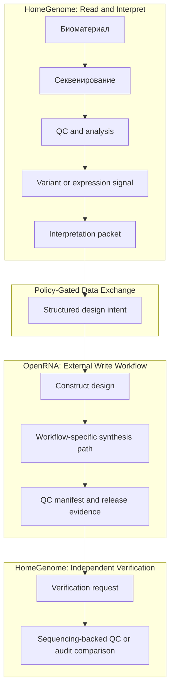

# Интеграция HomeGenome и OpenRNA: концептуальный горизонт "Read-Write"

**Статус:** horizon architecture, а не текущая реализация.

**Роль документа:** показать, как в будущем HomeGenome мог бы обмениваться структурированными данными с OpenRNA в закрытом research or translational контуре.

**Не утверждается:**

- домашняя терапия как готовый use case;
- клиническая или регуляторная готовность такого цикла;
- наличие реализованного end-to-end синтезатора или валидированного release flow внутри HomeGenome.

См. также [../reference/intended-use.md](../reference/intended-use.md) и [../reference/research-and-safety-boundary.md](../reference/research-and-safety-boundary.md).

---

## 1. Зачем вообще нужен этот bridge

HomeGenome в базовом контуре отвечает за чтение, анализ, QC, интерпретацию и выпуск review-ready evidence bundles.

OpenRNA, в своей собственной области, проектируется как control plane для RNA-centric therapeutic workflows.

Их возможная точка соприкосновения не в том, чтобы превратить HomeGenome в терапевтическую систему, а в том, чтобы однажды замкнуть **информационный цикл**:

1. `Detect` — выявить релевантный генетический или регуляторный сигнал.
2. `Design` — сформировать machine-readable design intent для внешнего RNA workflow.
3. `Verify` — проверить, что downstream product or construct соответствует ожидаемому дизайну и provenance.

В 2026 году это следует рассматривать как **архитектурную гипотезу**, а не как готовую эксплуатационную модель.

## 2. Минимальный информационный цикл

### Цикл `Detect → Design → Verify`

Ключевой принцип: HomeGenome не обязан знать, как устроен весь downstream synthesis runtime. Ему нужен только чёткий, policy-controlled handoff contract и независимый verification loop.

## 3. Какие данные HomeGenome потенциально может отдавать

Если такой bridge когда-либо будет изучаться practically, HomeGenome должен отдавать не «сырой поток пожеланий», а строго ограниченный пакет:

- идентификатор кейса и provenance context;
- reference bundle version;
- variant, HLA, expression or methylation signals, которые легли в основу решения;
- confidence и consensus metadata;
- policy flags: research-only, manual review required, no-release-without-second-gate;
- explicit intended-use label.

Это делает bridge похожим на контролируемый interoperability contract, а не на свободный терапевтический prompt.

## 4. Horizon scenarios, а не текущие use cases

### Сценарий A. Replacement-style RNA hypothesis

Гипотеза: HomeGenome выявляет loss-of-function or expression-deficit pattern и передаёт структурированный signal packet во внешний RNA design workflow.

Чего этот документ **не** утверждает:

- что такой путь валиден clinically;
- что HomeGenome должен сам заниматься терапевтическим design;
- что домашнее применение такого сценария допустимо или безопасно.

### Сценарий B. Personalized neoantigen workflow

Гипотеза: HomeGenome подготавливает evidence packet для downstream neoantigen ranking and construct design workflow.

Это соответствует текущей translational logic в индустрии лучше, чем произвольные consumer-therapy narratives, но всё равно остаётся внешним и policy-gated сценарием.

### Сценарий C. Verification of RNA outputs

Наиболее реалистичная часть всего bridge уже сегодня выглядит не как synthesis-at-home, а как **independent sequencing-backed verification** of downstream RNA artifacts in a controlled setting.

Именно verification-loop — самая defensible часть bridge architecture.

## 5. Direct RNA sequencing как verification seam

Самая сильная техническая точка соприкосновения между проектами — идея независимой sequencing-backed QC-проверки RNA outputs.

Если downstream workflow когда-либо производит RNA construct в закрытом research or translational контуре, HomeGenome теоретически может использовать:

- direct RNA sequencing;
- length completeness checks;
- poly-A related QC features;
- comparison against expected design intent;
- artifact provenance binding between expected and observed outputs.

Это не делает HomeGenome «контролёром качества терапии по умолчанию». Это лишь показывает, что sequencing-first verification logically fits the architecture.

## 6. Минимальные safety and governance controls

Без этих контролей bridge не должен даже рассматриваться как активный модуль:

1. `Policy gate` — disabled by default, explicit activation only.
2. `RBAC and review` — separate permissions for design request, approval and release.
3. `Cryptographic provenance` — signed packets and tamper-evident evidence.
4. `Sequence safety screening` — local toxin, risk and forbidden-sequence checks where applicable.
5. `Second-gate release` — no downstream handoff on a single analyst decision.
6. `Intended-use labeling` — research-only or translational-only tags carried with the packet.

## 7. Почему это не должно входить в HomeGenome MVP

На апрель 2026 есть как минимум четыре blockers:

1. scientific uncertainty around end-to-end therapeutic design;
2. regulatory and quality-system distance between analysis and release;
3. manufacturing and wet-lab realities that sit outside current HomeGenome scope;
4. elevated biosecurity and misuse risk compared with read-only genomics.

Поэтому правильный engineering stance такой:

- HomeGenome MVP = read-only and evidence-first.
- OpenRNA bridge = explicit horizon module.

## 8. Резюме

Bridge между HomeGenome и OpenRNA имеет смысл как **концептуальная архитектура информационного обмена и verification loop**, а не как обещание настольной фабрики терапии.

Если этот контур и должен когда-либо появиться, он должен начинаться с:

1. evidence packet contracts;
2. policy gates;
3. independent verification;
4. clear intended-use boundaries.

Пока этого нет, bridge должен оставаться horizon document and safety-conscious research architecture.
